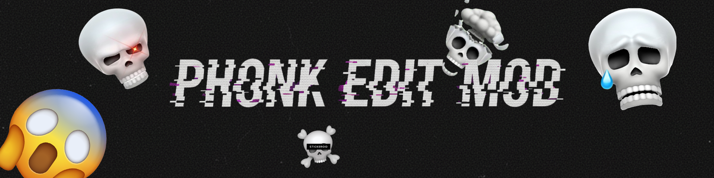
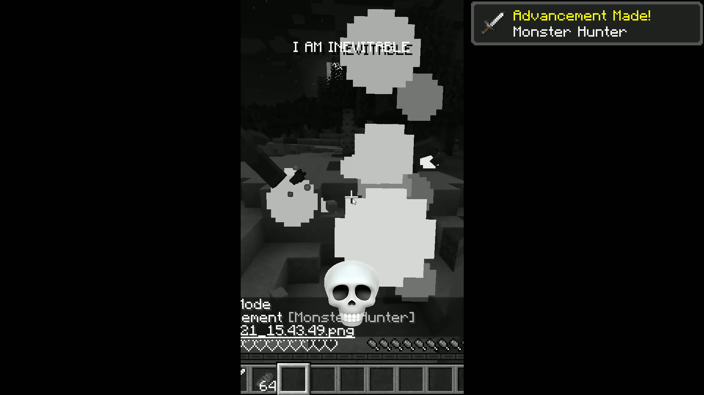
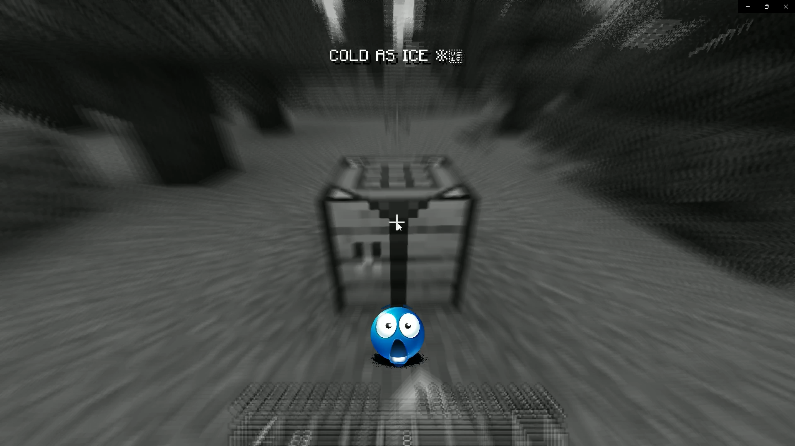

# 💀 Phonk Edit Mod

[](https://www.minecraft.net/)
[](https://modrinth.com/mod/fabric-api)
[](LICENSE)

A Minecraft Fabric mod that recreates the viral **YouTube Shorts "Phonk Edit" meme**! Transform your gameplay into epic cinematic moments with automatic pauses, phonk music drops, visual effects, and camera shake - all synced to the beat! 🎵💥



## 🎬 Demo


*Watch the effect in action! The mod activates automatically during gameplay.*

## ✨ Features

### 🎬 **Automatic Meme Triggers**
- **Random Timer**: Activates every 30-60 seconds (configurable)
- **Action-Based Triggers** (30% chance, configurable):
  - Attack entities ⚔️
  - Break blocks ⛏️
  - Interact with blocks 🔧 (place, open chests, use doors, etc.)
  - Use items 🍖 (eat, drink, bow, potions, etc.)
  - Take damage 💔

### 🎵 **Audio System**
- **9 Phonk Sound Tracks** included
- **Random pitch variation** (0.2x - 2.0x speed)
- **Beat-synced effects** - faster music = more intense beats!
- **Custom Audio Support** ✨ NEW!
  - Add your own OGG audio files
  - Hot-reload without restarting
  - 3 modes: Mod Only / Mix / Custom Only

### 🎨 **Visual Effects**
- **Grayscale Filter** - Full B&W screen including HUD (Satin API)
- **Radial Blur** - Extreme distortion that pulses with beats
- **Beat-Synced Zoom** - Camera zooms in/out with music (1.0x → 1.3x)
- **Camera Shake** - Violent screen tremor, intensifies at end
- **Mobile Format** - Black bars on sides (9:16 aspect ratio)
- **Random Skull Overlay** - 10 colorful skull images
- **Meme Text** - 15 random phrases at top ("SIGMA GRINDSET", "COLD AS ICE", etc.)

### 🖼️ **Custom Resources** ✨ NEW!

#### Custom Images
- **Add your own images** - Place PNG files in `.minecraft/phonk-edit-mod/custom_images/`
- **Hot-Reload** - Load new images without restarting the game!
- **3 Modes**:
  - **Mod Only**: Uses the 10 included skull images
  - **Mix**: Randomly alternates between mod and custom images
  - **Custom Only**: Uses only your custom images
- **Easy Access** - "Open Images Folder" button in config menu
- **Error Detection** - Toast notifications for invalid files (non-PNG) ✨ NEW!

#### Custom Audio
- **Add your own audio** - Create a resource pack with custom phonk songs!
- **3 Modes**:
  - **Mod Only**: Uses the 9 included phonk tracks
  - **Mix**: Randomly alternates between mod and custom audio
  - **Custom Only**: Uses only your custom audio from resource packs
- **Hot-Reload** - Press F3+T or "Reload Custom Files" button
- **Auto-Generated Pack**: Tutorial resource pack created at `resourcepacks/PhonkEdit-CustomSongs/`
- **Error Detection** - Toast notifications for invalid audio files (non-OGG) ✨ NEW!
- **Requirements**: 
  - OGG Vorbis format only
  - Registered in resource pack's `sounds.json` under `"custom/"` keys
  - Example: `"custom/my_phonk": { "sounds": ["phonk-edit-mod:custom/my_phonk"] }`



*The full effect in action - grayscale, blur, zoom, skull overlay, and meme text!*

### ⚙️ **Fully Configurable**
- **Config Menu** - Press `O` to open settings
- **Adjustable Parameters**:
  - Timer intervals (5-120s, 10-180s)
  - Effect duration (1-3 seconds)
  - Action trigger chance (0-100%)
  - Delay before activation (milliseconds)
  - Pitch range (0.2x - 2.0x)
  - Music volume (0-100%)
  - Icon size (16-128px)
  - Effect intensities (zoom/blur/shake: 0.5x-2.0x)
  - **Image Mode** (Mod Only / Mix / Custom Only) ✨ NEW!
  - **Audio Mode** (Mod Only / Mix / Custom Only) ✨ NEW!
- **Toggle Switches** for triggers and individual effects
- **Quick Access Buttons**:
  - Open custom images folder
  - Open custom audio folder ✨ NEW!
  - Reload custom files without restarting
- Settings saved to `config/phonk-edit-mod.json`


*Easy-to-use configuration menu - press `O` to customize everything!*

### 🎯 **Beat Synchronization**
The mod calculates BPM based on pitch and creates **rhythmic pulses**:
- Each beat triggers a **zoom + blur combo**
- Higher pitch = faster beats, more pulses
- Lower pitch = slower, heavier beats
- Final 10% = EXTREME shake and chaos

## 📦 Installation

### Requirements
- **Minecraft 1.21**
- **Fabric Loader 0.17.3+** ([Download](https://fabricmc.net/use/installer/))
- **Fabric API 0.102.0+** ([CurseForge](https://www.curseforge.com/minecraft/mc-mods/fabric-api) | [Modrinth](https://modrinth.com/mod/fabric-api))
- **Java 21**

### Steps
1. Install [Fabric Loader](https://fabricmc.net/use/installer/)
2. Download [Fabric API](https://modrinth.com/mod/fabric-api) and place in `mods` folder
3. Download **Phonk Edit Mod** from [Releases](https://github.com/LuigiLoeck/Phonk-Edit-Mod/releases)
4. Place the mod JAR in your `.minecraft/mods` folder
5. Launch Minecraft with Fabric profile

## 🎮 Usage

### Automatic Mode
Just play normally! The mod will trigger randomly or when you perform actions.

### Configuration
1. Press **`O`** key to open config menu
2. Scroll through settings with mouse wheel
3. Adjust sliders and toggles
4. Settings save automatically

### Adding Custom Resources
#### Custom Images:
1. Click "Open Images Folder" in config menu (or navigate to `.minecraft/phonk-edit-mod/custom_images/`)
2. Add your PNG files (512x512 recommended)
3. Press F3+T or click "Reload Custom Files"
4. Toast notification will show: "X images loaded" ✅ or "X invalid images (PNG only!)" ❌

#### Custom Audio:
1. Click "Open Audio Folder" in config menu (opens `resourcepacks/PhonkEdit-CustomSongs/`)
2. Place OGG files in `assets/phonk-edit-mod/sounds/custom/`
3. Edit `sounds.json` to register your sounds under `"custom/"` namespace
4. Press F3+T or click "Reload Custom Files"
5. Toast notification will show: "X audios loaded" ✅ or "X invalid audio (OGG only!)" ❌

### Config File Location
`<minecraft_folder>/config/phonk-edit-mod.json`

## 🛠️ For Developers

### Building from Source
```bash
git clone https://github.com/LuigiLoeck/Phonk-Edit-Mod.git
cd phonk-edit-mod
./gradlew build
```
Built JAR will be in `build/libs/`

### Project Structure
```
src/
├── client/
│   ├── java/com/luigi/phonkeditmod/
│   │   ├── PhonkEditModClient.java          # Main client logic
│   │   ├── ConfigScreen.java                # GUI configuration
│   │   ├── ModConfig.java                   # Config data model
│   │   ├── CustomResourceManager.java       # Image loading & validation
│   │   ├── CustomSoundDetector.java         # Resource pack audio detection
│   │   ├── TutorialResourcePackGenerator.java # Auto-generate tutorial pack
│   │   ├── NotificationToast.java           # Achievement-style notifications
│   │   ├── InvisiblePauseScreen.java        # Transparent pause
│   │   └── mixin/
│   │       ├── GameRendererMixin.java       # Camera effects
│   │       └── CameraAccessor.java          # Camera access
│   └── resources/
│       └── assets/phonk-edit-mod/
│           ├── sounds/                       # 9 phonk tracks
│           ├── textures/gui/                 # 10 skull images + icon
│           └── shaders/                      # Grayscale & blur shaders
└── main/
    ├── java/com/luigi/phonkeditmod/
    │   └── PhonkEditMod.java                # Common entry point
    └── resources/
        └── fabric.mod.json                   # Mod metadata
```

### Dependencies
- **Fabric API** - Required
- **Satin API 2.0.0** - Shader management (bundled)

### Tech Stack
- **Mixins** - Camera manipulation (SpongePowered 0.8.7)
- **Shaders** - GLSL shaders for visual effects
- **Events** - ClientTick, HudRender, AttackEntity, BlockBreak, etc.
- **Concurrency** - ScheduledExecutorService for delays
- **JSON** - Gson for config persistence

## 📝 Changelog

See [CHANGELOG.md](CHANGELOG.md) for full version history.

### Version 1.1.0 (Latest) - 2025-11-05
**Custom Resources Update** ✨
- Added custom image support (PNG files)
- Added custom audio support via resource packs (OGG Vorbis)
- Auto-generated tutorial resource pack
- Resource pack auto-activation system
- Hot-reload functionality (F3+T or button in config)
- Achievement-style toast notifications for loaded resources
- Error detection for invalid files (non-PNG/non-OGG)
- Image Mode selector (Mod Only / Mix / Custom Only)
- Audio Mode selector (Mod Only / Mix / Custom Only)
- "Open Images Folder" button in config
- "Open Audio Folder" button in config (opens resource pack)
- Configurable effect intensities (zoom/blur/shake)

### Version 1.0.0 - 2025-10-21
- Initial release
- 9 phonk sound tracks
- 10 skull overlay images
- Grayscale shader with Satin API
- Beat-synced zoom and blur
- Camera shake effects
- Mobile format bars
- 15 random meme texts
- Full configuration system
- Action triggers with delays
- Pitch-based BPM calculation

## 📜 License

This project is licensed under the **MIT License** - see [LICENSE](LICENSE) file for details.

## 🤖 Development

This mod was developed using **vibe coding** with AI assistance! 🎵✨

**AI-Powered Development:**
- Developed with assistance from **GitHub Copilot** (Claude 3.5 Sonnet)
- Extensively tested and validated by the developer
- All code reviewed and optimized for performance and safety

**⚠️ Transparency & Trust:**
- ✅ Extensively tested in survival and creative modes
- ✅ No malicious code - **completely safe**
- ✅ Full source code available on [GitHub](https://github.com/LuigiLoeck/Phonk-Edit-Mod)
- ✅ If you don't trust AI-assisted code, **review the source yourself!**

The mod is open-source precisely so you can verify everything yourself. AI helped write the code, but I tested every feature thoroughly before release.

## 🙏 Credits

- **GitHub Copilot** (Claude 3.5 Sonnet) - AI coding assistance
- **Satin API** by Ladysnake - Shader management library
- **Fabric** - Modding framework
- **Phonk Music Genre** - For the vibes 🎵
- **YouTube Shorts Editors** - For the meme inspiration

## 📧 Support

- **Issues**: [GitHub Issues](https://github.com/LuigiLoeck/Phonk-Edit-Mod/issues)

---

<div align="center">

**Made with ❤️ by luigi**

*"SIGMA GRINDSET" - "COLD AS ICE ❄️" - "LITERALLY ME"*

[](https://github.com/LuigiLoeck/Phonk-Edit-Mod)

</div>
